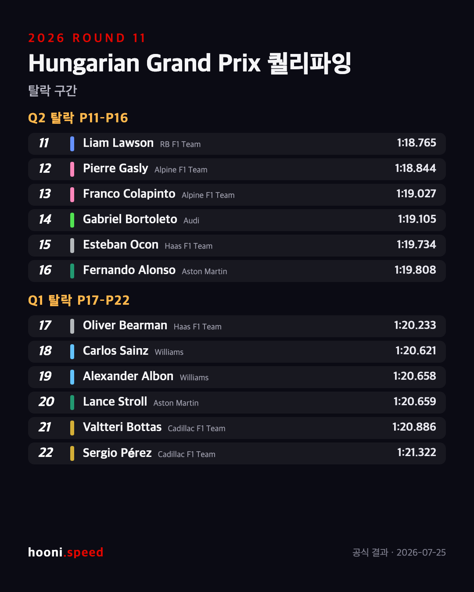
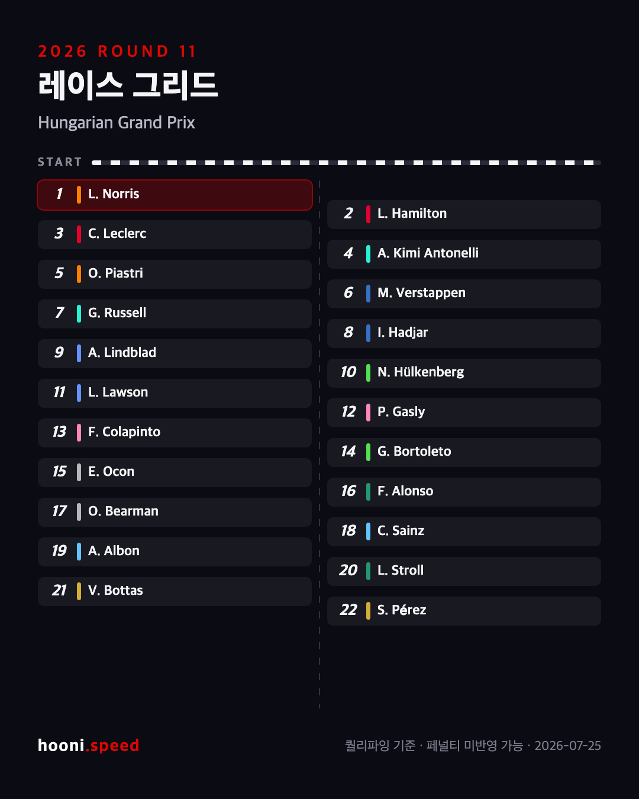
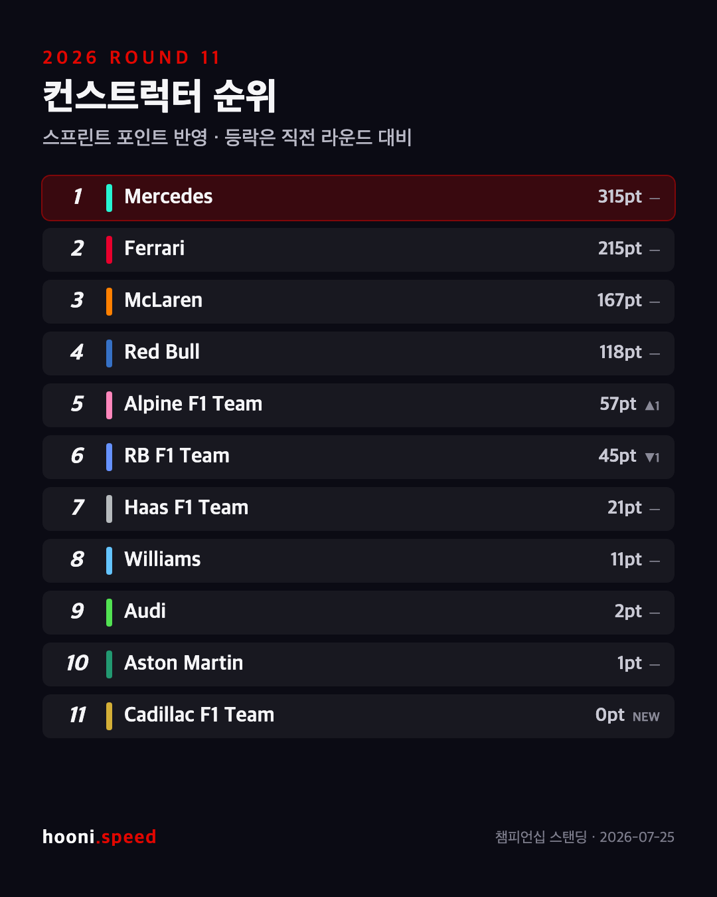
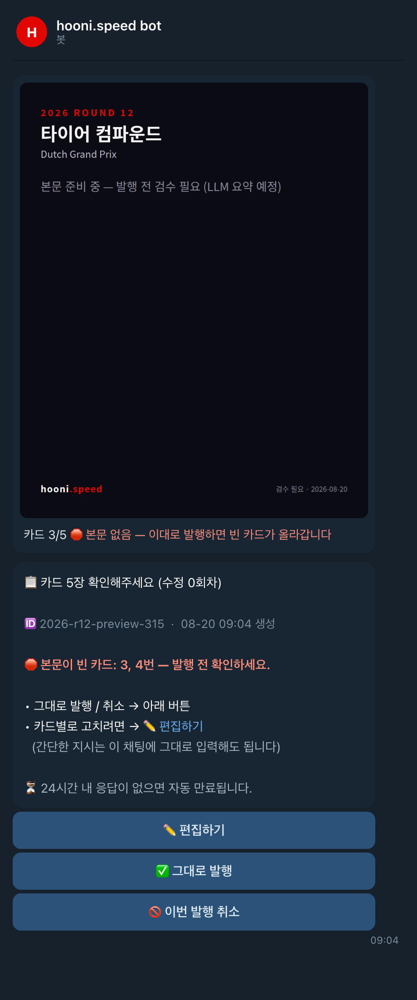
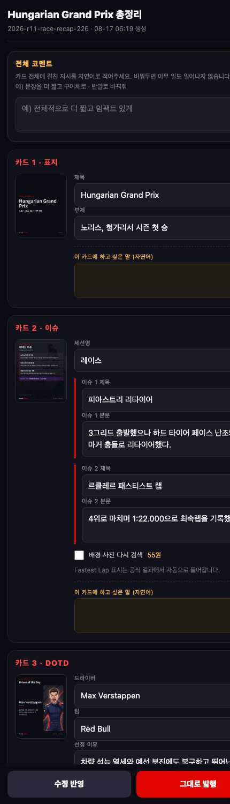
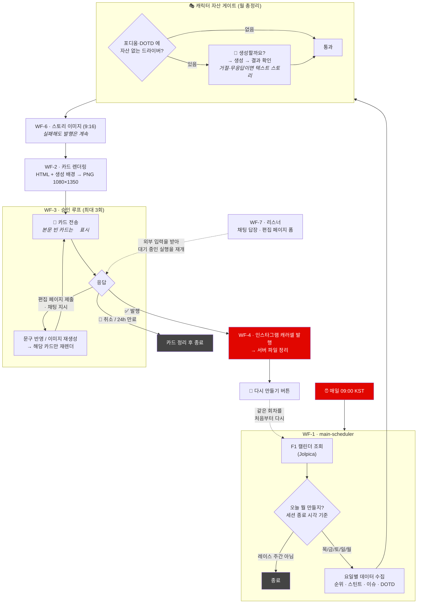
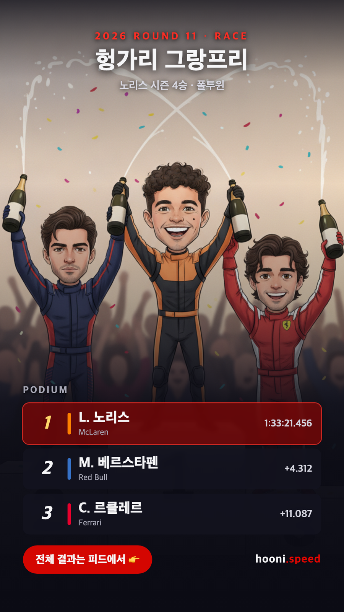
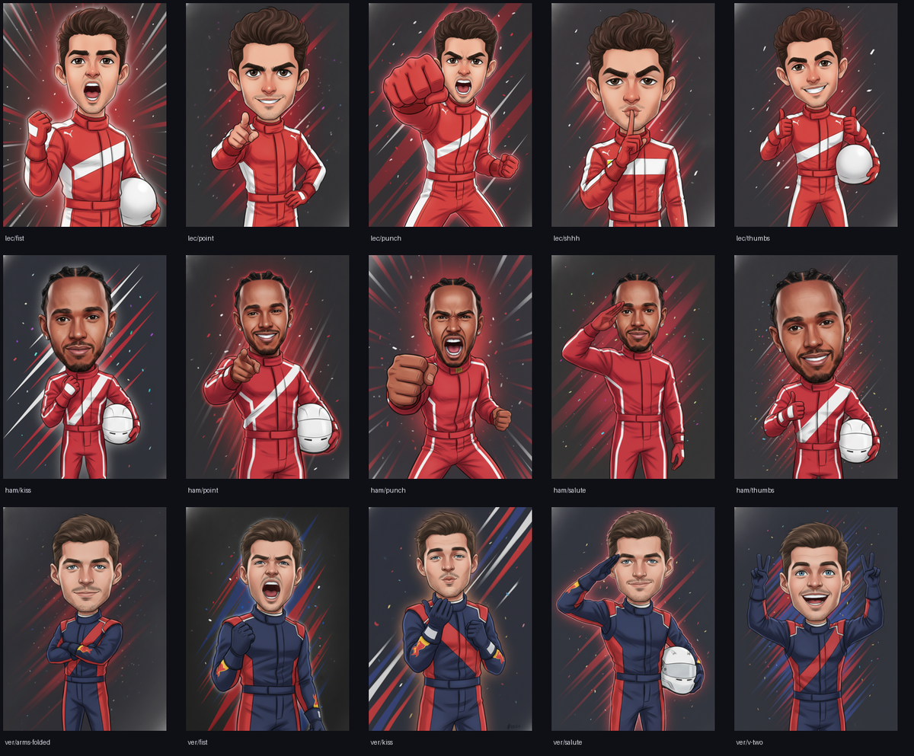

# 후니스피드 (hooni.speed)

F1 그랑프리 주말의 카드뉴스를 **데이터 수집부터 인스타그램 발행까지 자동으로** 만드는 n8n 파이프라인.

목요일 프리뷰부터 월요일 총정리까지 주 5회, 사람이 하는 일은 텔레그램으로 도착한 카드를 보고 발행 버튼을 누르는 것뿐이다.

고칠 게 있으면 **편집 페이지**에서 카드별로 문구를 수정하고 이미지 재생성을 체크해 제출한다 — 수정된 카드만 다시 만들어 승인을 다시 요청한다. 간단한 지시는 채팅에 그대로 입력해도 된다. 잘못 발행했다면 발행 완료 알림의 버튼으로 처음부터 다시 만들 수 있다.

<p align="center">
  
  
  
</p>

<p align="center">
  
  &nbsp;&nbsp;
  
</p>
<p align="center">
  <sub>왼쪽 — 텔레그램 승인 요청. 본문이 빈 카드는 🛑 로 짚어준다 (2026-08-20에 실제로 발행된 빈 카드)<br>
  오른쪽 — 편집 페이지. 카드별로 문구를 고치고 이미지 재생성을 지정한다</sub>
</p>

---

## 어떻게 동작하나

매일 아침 9시(KST)에 깨어나서, 오늘이 F1 주말의 며칠째인지 스스로 판단하고, 그날에 맞는 카드를 만들어 승인을 요청한다.



워크플로를 하나로 만들지 않고 쪼갠 이유는, n8n에서 한 구간을 고칠 때마다 전체를 다시 import하지 않기 위해서다. 렌더링(WF-2)과 승인(WF-3)은 특히 자주 만지는 곳이라 서브워크플로로 분리해뒀다.

| | 역할 |
|---|---|
| **WF-1** main-scheduler | 캘린더 판독 → 요일 판별 → 데이터 수집 → 캐릭터 자산 게이트 → 나머지 호출. 발행 후 재요청 진입점도 여기다 |
| **WF-2** card-renderer | HTML 템플릿 + 데이터 → browserless 스크린샷 → PNG |
| **WF-3** approval-loop | 텔레그램 카드 전송 → 수정 지시 해석 → 재렌더 → 재승인 |
| **WF-4** publisher | 인스타그램 캐러셀 발행 → 발행 확인 후 파일 삭제 |
| **WF-5** asset-gen | 웹훅으로 받은 프롬프트 → Gemini 이미지 생성 → 서버 저장. **보조 도구이며 현재 비활성** — 자산 게이트는 WF-1에서 직접 생성한다 |
| **WF-6** meme-story | 밈 컨셉 → 9:16 스토리 이미지 (표지 배경은 서킷 자산을 쓴다) |
| **WF-7** telegram-listener | 외부 입력(채팅 답장·편집 페이지 폼)을 받아 대기 중인 WF-3 실행을 재개 |

## 요일마다 다른 것을 만든다

**요일이 아니라 실제 세션 종료 시각으로 판별한다.** 라스베이거스처럼 레이스가 토요일 밤에 열리는 경우가 있어서, 달력의 요일을 믿으면 틀린다. "지난 24시간 안에 어떤 세션이 끝났는가"를 보고 오늘의 콘텐츠를 정한다. (`workflows/day-type-logic.js`)

| 요일 | 타입 | 내용 |
|---|---|---|
| 목 | `preview` | 트랙 정보 · 타이어 컴파운드 · 이슈(주제별 블록) · 작년 포디움 |
| 금 | `guide` | KST 세션 시간표 · 팀별 드라이버 라인업 |
| 토 | `practice-results` | FP1 · FP2 결과 (전원) |
| 일 | `quali-results` | Q3 · 탈락 구간 · 스타팅 그리드 |
| 월 | `race-recap` | 레이스 결과 전원 · 이슈 · DOTD · 타이어 전략 · 양대 순위 |

스프린트 주간에는 토·일이 각각 `sprint-fri-results` / `sprint-sat-results` 로 갈라진다.

## 렌더링 — 왜 하이브리드인가

카드는 **생성 이미지를 배경에 깔고, 그 위에 HTML/CSS로 데이터를 얹는** 방식으로 만든다.

```
Gemini 생성 배경  ─┐
                  ├─→  HTML 조립  ─→  browserless(Puppeteer)  ─→  PNG 1080×1350
HTML 템플릿+데이터 ─┘                     스크린샷
```

이미지 생성 모델에 "순위표를 그려줘"라고 시키면 숫자를 틀리게 그린다. 그래서 **분위기는 생성 이미지가, 숫자는 HTML이 담당한다.** API에서 받은 값을 템플릿에 그대로 바인딩하기 때문에 LLM이 수치를 지어낼 여지가 없다.

포디움 스토리 이미지도 같은 원칙이다 — 그림에는 인물만 그리고, 순위와 기록은 HTML 오버레이로 올린다.

<p align="center">
  
  
</p>

## 캐릭터 자산

드라이버 22명을 통일된 화풍(치비 캐리커처)으로 미리 생성해두고 재사용한다. 매번 새로 만들면 같은 사람이 매주 다르게 생긴다.

- `assets/characters-v2/` — 드라이버 22명 기본 캐릭터
- `assets/dotd/<코드>/<포즈>.png` — Driver of the Day 카드용 액션 포즈. 라운드 번호로 나눠 매주 다른 포즈를 쓴다

화풍의 단일 출처는 **`workflows/style.js`** 다. `gen-assets.js`(로컬 생성)와 `build-wf1.js`(즉석 생성)가 이 파일을 함께 참조한다. 복사본을 만들면 두 경로가 서로 다른 그림을 만들게 된다.

**로스터에 없는 드라이버가 등장하면** — 부상 교체 등으로 자산이 없는 드라이버가 포디움이나 DOTD에 들면, 캐릭터 생성 여부를 텔레그램으로 먼저 묻는다. 생성물도 눈으로 확인한 뒤에야 라이브러리에 들어간다. 거절하거나 응답이 없으면 캐릭터 없이 텍스트로 스토리를 만든다 — 발행이 멈추지는 않는다.

> 생성 과정에서 **스폰서 로고가 계속 새어 나오는 문제**가 있었다. 금지 문구를 강화하는 방식은 네 번 실패했고, 결국 효과가 있었던 건 가슴에 대각선 스트라이프를 넣어 **모델이 로고를 넣을 빈 공간 자체를 없애는** 방식이었다. 자세한 내용은 [CARD-SPEC.md](CARD-SPEC.md#캐릭터-생성-규칙).

## 조용한 실패를 막는 장치들

이 파이프라인의 원칙은 **"실패해도 발행은 계속된다"** 다. 리서치나 사진 검색이 실패해도 나머지 카드는 나가야 하기 때문에 `onError: continueRegularOutput` 으로 삼킨다.

문제는 그 대가다. **삼킨 실패는 눈에 보이지 않는다.** 실제로 리서치가 실패한 채로 본문이 빈 카드가 인스타그램에 발행된 적이 있고, 그때 얻은 교훈으로 아래 장치들을 붙였다.

**① 실패는 삼키되 원인은 남긴다**

리서치 결과는 성공·실패 무관하게 `last-research.json` 에 원문과 실패 사유를 남긴다. 진단 파일이 없으면 "왜 비었는지"를 알 방법이 없다.

```json
{ "ok": false, "branch": "preview", "attempts": 3,
  "diag": { "reason": "...", "raw": "You exceeded your current quota ..." } }
```

`attempts` 가 3인데 `ok: false` 면 재시도로 해결되지 않는 문제 — 프롬프트나 쿼터를 의심한다.

**② 의미상 실패에도 재시도한다**

n8n HTTP 노드의 `retryOnFail` 은 통신 실패만 잡는다. 모델이 200 OK 로 `null` 이나 깨진 JSON을 돌려주면 노드는 "성공"으로 통과하고, 실패는 다음 Code 노드에서야 드러난다. **감지 지점과 재시도 지점이 어긋나 있어서 재시도가 한 번도 돌지 않았다.**

n8n에는 루프가 없으므로 시도 횟수만큼 노드를 펼친다. 재시도마다 temperature를 올려 같은 실패가 반복되지 않게 한다.

```
Research → Parse → 실패? ─예→ Research 2 (temp↑) → Parse → 실패? ─예→ Research 3 (temp↑) → Parse ─┐
                     └─아니오────────────────────────┴─아니오──────────────────────────────────────┴→ 확정
```

**③ 경고는 실패했을 때만 켠다**

승인 요청에 "⚠️ 검수 필요" 표시가 이미 있었는데도 빈 카드를 놓쳤다. 그 표시가 **LLM을 쓰는 카드라는 고정 선언**이라 성공·실패와 무관하게 항상 켜져 있었기 때문이다. **상시 경고는 경고가 아니다.**

그래서 본문이 실제로 비었는지를 카드 데이터로 판정해 따로 표시한다.

```
⚠️ 검수 필요(LLM 생성)   ← 상시 (참고용)
🛑 본문 없음             ← 실제로 비었을 때만
```

**④ 되돌릴 수 있게 만든다**

발행 직후 카드 파일은 삭제되고 인스타그램 게시물은 API로 지울 수 없다. 잘못 발행하면 복구 경로가 없었다. 그래서 발행 완료 알림에 `🔄 다시 만들기` 버튼을 붙였다 — 같은 회차를 처음부터 다시 만들어 승인 요청을 다시 보낸다.

덕분에 자산 게이트의 무응답 같은 상황도 **되돌릴 수 없는 실패가 아니라 미룰 수 있는 실패**가 된다.

**⑤ 모든 알림에 식별자를 붙인다**

주 5회 발행에 재요청까지 겹치면 같은 GP의 여러 세트가 대화에 섞인다. 승인·만료·발행완료 알림에 `🆔 <폴더명>` 이 없으면 어느 요청에 대한 응답인지 알 수 없다.

**⑥ 일부만 보여줄 때는 그렇다고 말한다**

순위 카드는 22명 전원을 싣는다. 상위 몇 명만 보여주면 데이터가 빠진 것처럼 읽히기 때문이다. 연습주행과 스프린트 퀄리파잉은 원래 상위 10명이었는데 전원으로 바꿨다.

다만 타이어 전략 카드는 순위표가 아니라 랩 타임라인이라, 22명을 넣으면 행이 26px까지 눌려 구간 라벨(`M 1-22`, `H 23-72`)이 사라진다. 여기서는 **상위 10명으로 제한하고, 제목 아래에 `상위 10명` 배지를 붙여** 의도된 범위임을 밝힌다.

예전에는 제목에 `타이어 전략 (Top 5)` 처럼 괄호로 적었는데, **제목 속 괄호는 눈에 걸리지 않아** 여전히 잘린 것처럼 읽혔다. 범위 표시는 눈에 보여야 표시다.

**⑦ 성공 화면을 응답 없이 띄우지 않는다**

편집 페이지의 폼 제출은 **처음부터 한 번도 동작한 적이 없었다.** 대기 웹훅이 GET만 받는데 페이지는 POST를 보내고 있었다. 그런데 화면에는 매번 `✅ 수정 요청 접수` 가 떴다.

```js
// fetch 는 404·500 에도 reject 하지 않는다. 네트워크가 끊길 때만 reject한다.
fetch(url, {...}).then(function () { done('✅', '수정 요청 접수'); })
```

**서버가 거부했는데 성공으로 보였기 때문에 고장을 알 방법이 없었다.** 수정 요청이 반영되지 않는 걸 여러 번 겪고서야 로그를 뒤져 찾았다.

```js
.then(function (r) {
  if (!r.ok) throw new Error('서버가 요청을 거부했습니다 (HTTP ' + r.status + ')');
  ...
})
```

앞의 다섯 항목이 "서버가 삼킨 실패를 드러내는" 이야기라면, 이건 **클라이언트가 스스로 만든 거짓 성공**이다. 실패를 감추는 코드는 실패보다 나쁘다.

## 저장소 구조

```
workflows/          n8n 워크플로 생성기
  build-wf*.js        ← 이걸 고친다. JSON은 산출물이라 커밋하지 않는다
  config.example.js   인스턴스별 값(계정 ID·자격증명 참조)의 템플릿
  style.js            캐릭터 화풍의 단일 출처 (생성기들이 공유)
  day-type-logic.js   요일 판별 로직 (n8n Code 노드와 동일 코드)
  local-render.js     서버 없이 로컬 Chrome으로 카드 렌더 (템플릿 검증용)
  gen-assets.js       캐릭터 자산 생성
  sync-assets.py      서버에서 생성된 자산을 저장소로 가져온다
  test-*.py           서버에 배포해서 돌리는 E2E 테스트
templates/          카드 HTML 템플릿 + 공용 CSS (1080×1350)
assets/             캐릭터·배경 이미지 (저장소가 원본 백업)
openspec/           변경 제안 · 설계 · 스펙 문서
CARD-SPEC.md        카드 구성 규칙의 단일 출처
```

**워크플로 JSON을 직접 편집하지 않는다.** `build-wf*.js` 를 고치고 다시 생성한다. n8n UI에서 손으로 고친 것은 다음 생성 때 덮어써진다.

## 로컬에서 돌려보기

계정 ID와 자격증명 참조는 `workflows/config.js` 에, 서버 접속 정보는 `.env` 에 둔다. 둘 다 커밋되지 않는다.

```bash
cp .env.example .env
cp workflows/config.example.js workflows/config.js
set -a && source .env && set +a
```

**워크플로 JSON 생성** — 저장소에는 생성기만 있으므로 클론 후 한 번은 돌려야 한다.

```bash
cd workflows
node build-wf1.js > wf1-main-scheduler.json
node build-wf2.js > wf2-card-renderer.json
node build-wf3.js > wf3-approval-loop.json
node build-wf4.js > wf4-publisher.json
node build-wf5.js > wf5-asset-gen.json
node build-wf6.js > wf6-meme-story.json
node build-wf7.js > wf7-telegram-listener.json
node build-wf-err-alert.js > wf-err-alert.json
```

**카드 템플릿 검증** — 서버 없이 로컬 Chrome으로 렌더한다. 프로덕션과 동일한 코드 경로(WF-2의 `Prepare Cards`)를 그대로 실행하기 때문에, 여기서 잘 나오면 서버에서도 잘 나온다.

```bash
node workflows/local-render.js payload.json    # → .render-out/ 에 PNG
```

**서버 E2E** — `workflows/` 안에서 실행한다.

```bash
cd workflows
python3 test-wf1.py preview 12     # WF-1 프리뷰 브랜치를 라운드 12로
python3 sim-weekend.py deploy      # 주말 전체 시뮬레이션 배포
```

**자산 동기화** — n8n은 git을 모른다. 자산 게이트가 만든 캐릭터는 **서버에만** 남으므로, 저장소로 가져와 커밋해야 백업이 된다.

```bash
python3 workflows/sync-assets.py            # 서버에 새로 생긴 자산 확인
python3 workflows/sync-assets.py --apply    # 내려받기 → 커밋 → 푸시
```

내용이 다른 파일은 기본적으로 가져오지 않는다. DOTD 이미지는 저장소가 원본이고 서버가 서빙용 경량화 사본이라, 그냥 당겨오면 원본이 압축본으로 덮어써진다.

## 956MB 서버에서 배운 것들

이 프로젝트는 RAM 956MB · 2코어짜리 OCI 프리티어 인스턴스에서 돌아간다. 그 제약이 설계를 상당 부분 결정했다.

- **카드 한 장 렌더에 40~70초.** 실측으로 3장짜리 관전 가이드가 약 2분, 5장짜리 프리뷰가 약 6분이다. 7장짜리 월요일 총정리는 10분 이상 잡아야 한다. browserless 기본 타임아웃(120초)으로는 한 장도 못 끝내서 요청 쿼리로 300초를 준다.
- **렌더링 중에는 워크플로를 배포하지 않는다.** 스왑이 폭주해서 VM이 마비된다. 실제로 서버를 몇 번 죽였다.
- **모든 HTTP 노드에 `executeOnce`가 필요하다.** n8n의 HTTP 노드는 입력 아이템 수만큼 반복 실행된다. API가 배열을 돌려주면 다음 노드가 20~60회 호출되면서 레이트리밋에 걸린다.
- **실패해도 발행은 계속되어야 한다.** 리서치·사진 노드는 `onError: continueRegularOutput` 이다. 대신 실패가 조용히 묻히므로 진단 파일(`last-research.json`)을 반드시 남긴다.
- **`import:workflow` 는 워크플로를 비활성화한다.** 생성된 JSON이 `active: false` 라서 그렇다. 배포 후 `update:workflow --active=true` 를 빠뜨리면 **스케줄러가 조용히 꺼진 채로 남고**, 다음 발행일에 아무것도 오지 않는다.
- **승인 대기 중에는 WF-3·WF-4 를 배포하지 않는다.** 대기 중인 실행은 `webhook-waiting/<실행ID>` 로 재개되는데, 워크플로 정의가 교체되고 n8n이 재시작되면 재개가 실패할 수 있다.
- **맥에서 `scp -r` 로 자산을 올리면 `._x.png` 부산물이 따라간다.** `.png` 로 끝나고 정렬에서 맨 앞이라, DOTD 포즈 선택에 섞이면 깨진 이미지가 카드에 들어간다.

## 문서

- **[CARD-SPEC.md](CARD-SPEC.md)** — 카드 구성·문구 규칙의 **단일 출처**. 텔레그램으로 보내는 수정 요청은 그 실행에만 적용되는 1회성이라, 매주 반복되어야 하는 요구사항은 반드시 여기에 적고 코드에 반영해야 한다. 문제가 생겼을 때 볼 곳도 정리되어 있다.
- **[openspec/](openspec/changes/f1-weekend-cardnews/)** — 제안 · 설계 결정 · 능력별 스펙

## 쓰는 것들

[Jolpica-F1](https://github.com/jolpica/jolpica-f1) · [OpenF1](https://openf1.org) · Google Gemini · [browserless](https://www.browserless.io) · [n8n](https://n8n.io) · Instagram Graph API · Telegram Bot API · [Pexels](https://www.pexels.com)

---

<sub>Formula 1과 무관한 개인 팬 프로젝트입니다. F1, FORMULA ONE 및 관련 상표는 Formula One Licensing B.V.의 자산입니다. 팀명·드라이버명은 사실 정보 전달 목적으로만 사용했으며, 캐릭터는 창작 캐리커처입니다.</sub>
