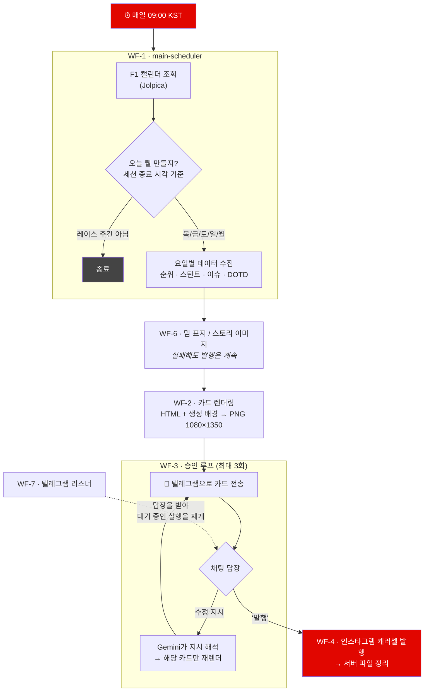

# 후니스피드 (hooni.speed)

F1 그랑프리 주말의 카드뉴스를 **데이터 수집부터 인스타그램 발행까지 자동으로** 만드는 n8n 파이프라인.

목요일 프리뷰부터 월요일 총정리까지 주 5회, 사람이 하는 일은 텔레그램으로 도착한 카드를 보고 "발행"이라고 답하는 것뿐이다. 마음에 안 드는 카드가 있으면 그것도 채팅으로 말하면 된다.

<p align="center">
  
  
  
</p>

---

## 어떻게 동작하나

매일 아침 9시(KST)에 깨어나서, 오늘이 F1 주말의 며칠째인지 스스로 판단하고, 그날에 맞는 카드를 만들어 승인을 요청한다.



워크플로를 하나로 만들지 않고 쪼갠 이유는, n8n에서 한 구간을 고칠 때마다 전체를 다시 import하지 않기 위해서다. 렌더링(WF-2)과 승인(WF-3)은 특히 자주 만지는 곳이라 서브워크플로로 분리해뒀다.

| | 역할 |
|---|---|
| **WF-1** main-scheduler | 캘린더 판독 → 요일 판별 → 데이터 수집 → 나머지 호출 |
| **WF-2** card-renderer | HTML 템플릿 + 데이터 → browserless 스크린샷 → PNG |
| **WF-3** approval-loop | 텔레그램 카드 전송 → 수정 지시 해석 → 재렌더 → 재승인 |
| **WF-4** publisher | 인스타그램 캐러셀 발행 → 발행 확인 후 파일 삭제 |
| **WF-5** asset-gen | 웹훅으로 받은 프롬프트 → Gemini 이미지 생성 → 서버 저장 |
| **WF-6** meme-cover / story | 밈 표지, 9:16 스토리 이미지 |
| **WF-7** telegram-listener | 채팅 답장을 받아 대기 중인 WF-3 실행을 재개 |

## 요일마다 다른 것을 만든다

**요일이 아니라 실제 세션 종료 시각으로 판별한다.** 라스베이거스처럼 레이스가 토요일 밤에 열리는 경우가 있어서, 달력의 요일을 믿으면 틀린다. "지난 24시간 안에 어떤 세션이 끝났는가"를 보고 오늘의 콘텐츠를 정한다. (`workflows/day-type-logic.js`)

| 요일 | 타입 | 내용 |
|---|---|---|
| 목 | `preview` | 트랙 정보 · 타이어 컴파운드 · 작년 이슈 · 작년 포디움 |
| 금 | `guide` | KST 세션 시간표 · 팀별 드라이버 라인업 |
| 토 | `practice-results` | FP1 · FP2 결과 |
| 일 | `quali-results` | Q3 · 탈락 구간 · 스타팅 그리드 |
| 월 | `race-recap` | 레이스 결과 전원 · 이슈 · DOTD · 타이어 전략 · 양대 순위 |

스프린트 주간에는 토·일이 각각 `sprint-fri-results` / `sprint-sat-results` 로 갈라진다.

## 렌더링 — 왜 하이브리드인가

카드는 **생성 이미지를 배경에 깔고, 그 위에 HTML/CSS로 데이터를 얹는** 방식으로 만든다.

```
Gemini 생성 배경  ─┐
                  ├─→  HTML 조립  ─→  browserless(Puppeteer)  ─→  PNG 1080×1350
HTML 템플릿+데이터 ─┘                     스크린샷
```

이미지 생성 모델에 "순위표를 그려줘"라고 시키면 숫자를 틀리게 그린다. 그래서 **분위기는 생성 이미지가, 숫자는 HTML이 담당한다.** API에서 받은 값을 템플릿에 그대로 바인딩하기 때문에 LLM이 수치를 지어낼 여지가 없다.

포디움 스토리 이미지도 같은 원칙이다 — 그림에는 인물만 그리고, 순위와 기록은 HTML 오버레이로 올린다.

<p align="center">
  
  
</p>

## 캐릭터 자산

드라이버 22명을 통일된 화풍(치비 캐리커처)으로 미리 생성해두고 재사용한다. 매번 새로 만들면 같은 사람이 매주 다르게 생긴다.

- `assets/characters-v2/` — 드라이버 22명 기본 캐릭터
- `assets/dotd/<코드>/<포즈>.png` — Driver of the Day 카드용 액션 포즈. 라운드 번호로 나눠 매주 다른 포즈를 쓴다

화풍의 단일 출처는 `workflows/gen-assets.js` 의 `STYLE_CORE` 다. 프롬프트를 바꾸려면 여기를 고친다.

> 생성 과정에서 **스폰서 로고가 계속 새어 나오는 문제**가 있었다. 금지 문구를 강화하는 방식은 네 번 실패했고, 결국 효과가 있었던 건 가슴에 대각선 스트라이프를 넣어 **모델이 로고를 넣을 빈 공간 자체를 없애는** 방식이었다. 자세한 내용은 [CARD-SPEC.md](CARD-SPEC.md#캐릭터-생성-규칙).

## 저장소 구조

```
workflows/          n8n 워크플로 생성기
  build-wf*.js        ← 이걸 고친다. JSON은 산출물이라 커밋하지 않는다
  config.example.js   인스턴스별 값(계정 ID·자격증명 참조)의 템플릿
  day-type-logic.js   요일 판별 로직 (n8n Code 노드와 동일 코드)
  local-render.js     서버 없이 로컬 Chrome으로 카드 렌더 (템플릿 검증용)
  gen-assets.js       캐릭터 자산 생성
  test-*.py           서버에 배포해서 돌리는 E2E 테스트
templates/          카드 HTML 템플릿 + 공용 CSS (1080×1350)
assets/             생성된 캐릭터·배경 이미지
openspec/           변경 제안 · 설계 · 스펙 문서
CARD-SPEC.md        카드 구성 규칙의 단일 출처
```

**워크플로 JSON을 직접 편집하지 않는다.** `build-wf*.js` 를 고치고 다시 생성한다. n8n UI에서 손으로 고친 것은 다음 생성 때 덮어써진다.

## 로컬에서 돌려보기

계정 ID와 자격증명 참조는 `workflows/config.js` 에, 서버 접속 정보는 `.env` 에 둔다. 둘 다 커밋되지 않는다.

```bash
cp .env.example .env
cp workflows/config.example.js workflows/config.js
set -a && source .env && set +a
```

**워크플로 JSON 생성** — 저장소에는 생성기만 있으므로 클론 후 한 번은 돌려야 한다.

```bash
cd workflows
node build-wf1.js > wf1-main-scheduler.json
node build-wf2.js > wf2-card-renderer.json
node build-wf3.js > wf3-approval-loop.json
node build-wf4.js > wf4-publisher.json
node build-wf5.js > wf5-asset-gen.json
node build-wf6.js > wf6-meme-story.json
node build-wf7.js > wf7-telegram-listener.json
node build-wf-err-alert.js > wf-err-alert.json
```

**카드 템플릿 검증** — 서버 없이 로컬 Chrome으로 렌더한다. 프로덕션과 동일한 코드 경로(WF-2의 `Prepare Cards`)를 그대로 실행하기 때문에, 여기서 잘 나오면 서버에서도 잘 나온다.

```bash
node workflows/local-render.js payload.json    # → .render-out/ 에 PNG
```

**서버 E2E** — `workflows/` 안에서 실행한다.

```bash
cd workflows
python3 test-wf1.py preview 12     # WF-1 프리뷰 브랜치를 라운드 12로
python3 sim-weekend.py deploy      # 주말 전체 시뮬레이션 배포
```

## 956MB 서버에서 배운 것들

이 프로젝트는 RAM 956MB · 2코어짜리 OCI 프리티어 인스턴스에서 돌아간다. 그 제약이 설계를 상당 부분 결정했다.

- **카드 한 장 렌더에 약 100초.** 7장짜리 월요일 총정리는 12분 이상 잡아야 한다. browserless 기본 타임아웃(120초)으로는 한 장도 못 끝내서 요청 쿼리로 300초를 준다.
- **렌더링 중에는 워크플로를 배포하지 않는다.** 스왑이 폭주해서 VM이 마비된다. 실제로 서버를 몇 번 죽였다.
- **모든 HTTP 노드에 `executeOnce`가 필요하다.** n8n의 HTTP 노드는 입력 아이템 수만큼 반복 실행된다. API가 배열을 돌려주면 다음 노드가 20~60회 호출되면서 레이트리밋에 걸린다.
- **실패해도 발행은 계속되어야 한다.** 리서치·사진 노드는 `onError: continueRegularOutput` 이다. 대신 실패가 조용히 묻히므로 진단 파일(`last-research.json`)을 반드시 남긴다.

## 문서

- **[CARD-SPEC.md](CARD-SPEC.md)** — 카드 구성·문구 규칙의 **단일 출처**. 텔레그램으로 보내는 수정 요청은 그 실행에만 적용되는 1회성이라, 매주 반복되어야 하는 요구사항은 반드시 여기에 적고 코드에 반영해야 한다. 문제가 생겼을 때 볼 곳도 정리되어 있다.
- **[openspec/](openspec/changes/f1-weekend-cardnews/)** — 제안 · 설계 결정 · 능력별 스펙

## 쓰는 것들

[Jolpica-F1](https://github.com/jolpica/jolpica-f1) · [OpenF1](https://openf1.org) · Google Gemini · [browserless](https://www.browserless.io) · [n8n](https://n8n.io) · Instagram Graph API · Telegram Bot API · [Pexels](https://www.pexels.com)

---

<sub>Formula 1과 무관한 개인 팬 프로젝트입니다. F1, FORMULA ONE 및 관련 상표는 Formula One Licensing B.V.의 자산입니다. 팀명·드라이버명은 사실 정보 전달 목적으로만 사용했으며, 캐릭터는 창작 캐리커처입니다.</sub>
