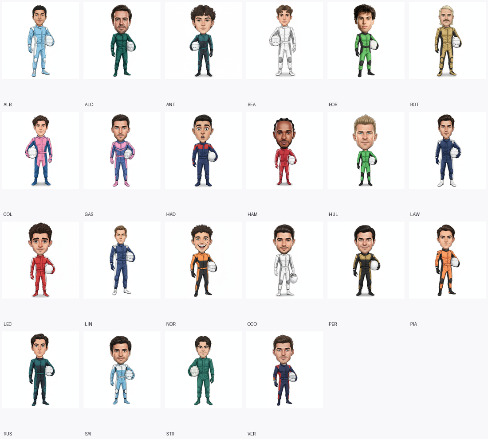

# 956MB 서버에서 F1 카드뉴스를 매일 자동 발행하기까지

> n8n · Gemini · browserless로 만든 인스타그램 자동화, 그리고 그 과정에서 부순 것들

## 만들려던 것

F1 그랑프리 주말마다 인스타그램에 카드뉴스를 올리고 싶었다. 문제는 이게 5일 내내
이어진다는 것이다.

```
목  프리뷰       트랙 · 타이어 컴파운드 · 작년 이슈 · 작년 포디움
금  관전 가이드   KST 세션 시간표 · 팀별 라인업
토  연습주행     FP1 · FP2 결과
일  퀄리파잉     Q3 · 탈락 구간 · 레이스 그리드
월  총정리       결과 · 이슈 · DOTD · 타이어 전략 · 순위 등락
```

여기에 스프린트 주간이면 구성이 통째로 바뀐다. FP2 자리에 스프린트 퀄리파잉이 들어가고,
일요일에는 스프린트 결과와 퀄리파잉을 한 번에 다뤄야 한다. 결국 요일별 레시피가 7종이 된다.

수동으로는 못 한다. 매주 한 시즌 23번을 반복할 자신이 없었다.

## 구조

```
n8n (OCI 프리티어, 956MB · 2코어)
├─ WF-1 스케줄러    매일 09:00 KST → 오늘 뭘 올릴지 판별 → 7개 브랜치로 분기
├─ WF-2 렌더러      HTML 템플릿 → browserless(Chromium) → PNG
├─ WF-3 승인        텔레그램으로 카드 전송 → 편집/발행 대기
├─ WF-4 발행        Instagram Graph API (캐러셀 + 스토리)
├─ WF-6 이미지      Gemini로 밈·포디움 이미지 생성
└─ WF-7 리스너      텔레그램 채팅 답장 수신
```


*퀄리파잉 탈락 구간. 2026 시즌은 22명이라 Q1에서 6명이 떨어진다. 구간 라벨(P17–P22)은
고정 문구가 아니라 실제 순위에서 계산한다 — 시즌마다 엔트리 수가 바뀌기 때문이다.*

데이터는 **Jolpica-F1**(결과·스탠딩·캘린더)과 **OpenF1**(연습주행·타이어 스틴트)에서 가져오고,
이슈 요약과 후킹 문구는 **Gemini**가 웹검색으로 조사한다. 카드는 HTML/CSS로 만들어
Chromium으로 스크린샷을 찍는다. 이미지 편집기를 붙이는 것보다 CSS로 레이아웃하는 게 훨씬 빨랐다.

### 요일이 아니라 세션 시각으로 판단한다

처음엔 요일로 분기하려 했다. 목요일이면 프리뷰, 일요일이면 레이스 결과.

그런데 라스베이거스 GP는 레이스가 현지 **토요일 밤**이다. 한국 시간으로는 일요일 오후다.
요일 기준이면 그 주말은 통째로 어긋난다.

```js
// 지난 24시간 안에 끝난 세션이 무엇인지로 판단한다
const ended = sessions.filter((s) => s.endMs <= nowMs && s.endMs > nowMs - 86400000);
const codes = new Set(ended.map((s) => s.code));
if (codes.has('RACE')) return { dayType: 'race-recap' };
```

캘린더에서 모든 세션의 실제 시각을 가져와 비교한다. 서머타임이든 야간 레이스든 자동으로 맞는다.

---

### 스타팅 그리드는 그리드처럼 보여야 한다

처음엔 순위를 일렬로 나열했다. 그런데 F1 그리드는 지그재그로 서고, 그 배치 자체가 정보다.
홀수 그리드를 왼쪽 열, 짝수를 오른쪽 열에 넣고 오른쪽을 반 칸 아래로 밀었다.


*위에서 내려다본 그리드가 된다. 상단 체커 패턴이 출발선, 가운데 점선이 트랙 중앙선이다.*

## 서버를 하루 동안 죽였다

가장 크게 부순 것부터.

956MB 서버에 Chromium(browserless)을 올렸다. 렌더링을 시작하자 메모리가 바닥났고,
**VM 전체가 24시간 응답하지 않았다.** 같은 서버에서 돌던 다른 서비스까지 멈췄다.

원인을 찾는 데 오래 걸렸다. 처음엔 타임아웃 문제라고 생각했고, 다음엔 n8n의 파일 노드를
의심했고, 그다음엔 "실행 데이터가 쌓여서"라고 결론 내렸다. 전부 틀렸다.

실제 원인은 **스왑이 0이었다.**

```bash
$ swapon --show
(빈 출력)
```

스왑 파일을 만들어뒀지만 `/etc/fstab`에 등록하지 않아서 재부팅 때 사라져 있었다. 메모리가
부족해지면 커널이 프로세스를 죽이는 대신 시스템 전체가 멈춰버린 것이다.

```bash
# zram(압축 스왑) + 디스크 스왑을 fstab에 영구 등록
zram 480MB (우선순위 100) + swapfile 2GB (우선순위 10)
```

여기에 컨테이너별 `mem_limit`을 걸고, 렌더링 시작 전에 여유 메모리를 확인하는 가드를 넣었다.

```js
const MIN_FREE_MB = 220;
let mb = availMb();
const deadline = Date.now() + 180000;
while (mb < MIN_FREE_MB && Date.now() < deadline) {
  await new Promise((r) => setTimeout(r, 6000));
  mb = availMb();
}
if (mb < MIN_FREE_MB) throw new Error('렌더링 중단: 여유 메모리 ' + mb + 'MB');
```

처음엔 즉시 실패시켰는데, 그러면 직전 단계(이미지 생성)가 메모리를 부풀려 놓은 순간에 걸려
멀쩡한 실행이 죽었다. **일시적 스파이크가 원인이니 기다리면 회복된다.** 즉시 실패에서
최대 3분 대기로 바꾸고 나서야 안정됐다.

### 배운 것

측정하지 않고 짐작으로 대응하면 시간만 버린다. 나는 이 문제 하나로 세 번 잘못된 원인을
지목했다. `swapon --show` 한 줄이면 끝날 일이었다.

---

## n8n HTTP 노드가 20번씩 호출되고 있었다

OpenF1 API에서 계속 레이트 리밋에 걸렸다.

```
The service is receiving too many requests from you
```

재시도 간격을 늘렸다. 안 됐다. 시간을 두고 재실행했다. 또 안 됐다. 그래서 서버에서
같은 요청 6개를 연속으로 보내봤다.

```
meetings?year=2026                200  1.09s
sessions?meeting_key=1291         200  0.78s
session_result?session_key=11335  200  0.84s
session_result?session_key=11336  200  0.79s
drivers?session_key=11335         200  0.80s
drivers?session_key=11336         200  0.77s
```

전부 성공했다. API 문제가 아니었다.

원인은 n8n의 동작 방식이었다. **HTTP 노드는 입력 아이템 수만큼 반복 실행된다.**
OpenF1이 드라이버 22명 배열을 돌려주면 n8n은 그걸 22개 아이템으로 쪼개고, 다음 노드가
22번 호출된다.

```
session_result → 22개 아이템
      ↓
drivers 노드가 22번 호출 💥
```

월요일 브랜치는 더 심했다. 스틴트 데이터가 60여 개로 쪼개지면서 **Gemini 리서치가
60번 호출될 구조**였다. 실행됐다면 요금이 그만큼 나갔을 것이다.

해결은 한 줄이다.

```js
const extra = { executeOnce: true };
```

모든 HTTP 노드에 붙였다. URL이 전부 `.first()`나 단일 아이템을 참조하므로 한 번만 실행하면
충분했다.

---

## 만료된 실행이 새 실행의 파일을 지웠다

"수정한 게 하나도 반영이 안 됐다"는 말을 여러 번 들었다. 코드를 확인하면 반영돼 있었다.
배포된 워크플로를 열어봐도 반영돼 있었다. 그런데 카드는 옛 형식이었다.

원인은 폴더 이름이었다.

```
00:48  이전 실행이 승인 대기 시작
06:06  새 실행이 카드 생성 (같은 폴더명: 2026-r11-race-recap)
12:48  이전 실행이 12시간 만료 → Cleanup 실행
       → 폴더명이 같아서 새 실행의 카드까지 삭제 💥
```

승인 대기가 최대 12시간이라 여러 실행이 동시에 살아 있을 수 있는데, 폴더명이 GP와 요일로만
정해져서 서로를 침범했다. 반영이 안 된 게 아니라 **파일이 중간에 지워진 것**이었다.

```js
// 실행 식별자를 폴더명에 넣는다
const runTag = String($execution.id || Date.now()).slice(-6);
const baseDirName = season + '-r' + round + '-' + dayType + '-' + runTag;
```

그리고 텔레그램 승인 메시지에 식별자와 생성 시각을 표시했다. 채팅에 카드 세트가 여러 개
쌓이면 어느 게 최신인지 알 방법이 없었기 때문이다.

```
📋 카드 7장 확인해주세요 (수정 0회차)
🆔 2026-r11-race-recap-226 · 08-17 06:19 생성
```

---

## LLM이 응답 전체를 null로 돌려줬다

이슈 카드가 자꾸 비어서 나왔다. `onError: continueRegularOutput` 설정 때문에 실패가
조용히 묻혀서 원인이 보이지 않았다.

응답 원문을 파일로 남기게 하고 다시 돌렸다.

```json
{
  "candidates": [{ "content": { "parts": [{ "text": "null" }] } }]
}
```

모델이 문자열 `"null"` 하나만 반환했다. 내 프롬프트가 문제였다.

```
"확실하지 않은 정보는 null."
```

개별 필드를 비우라는 뜻이었는데, 모델은 응답 전체를 null로 해석했다. 고친 문구는 이렇다.

```
반드시 최상위는 위 키들을 가진 JSON 객체여야 한다 —
응답 전체를 null로 출력하지 말 것.
정보를 못 찾은 개별 필드만 null로 두고, issues를 못 찾으면 빈 배열 []로 둘 것.
```

**실패를 삼키는 설정은 유지하되, 진단 파일은 반드시 남긴다.** 리서치가 실패해도 나머지
카드는 발행돼야 하므로 `onError`는 옳은 선택이지만, 눈에 안 보이는 게 문제였다.

---

## 스폰서 로고와의 싸움

드라이버 캐릭터를 Gemini로 만들었다. 실제 사진을 참조로 주고 캐리커처로 그리게 하는데,
**수트의 스폰서 로고가 계속 따라 그려졌다.**

금지 문구를 강화했다.

```
There must be ZERO logos, ZERO sponsor patches, ZERO brand marks...
```

실패. 어깨와 가슴을 콕 집어 금지했다. 실패. "leaping cat"을 명시적으로 금지했다. 실패.
로고 없는 캐릭터를 참조 이미지로 줬다. 또 실패. 특히 빨간 수트(페라리)가 끈질겼다.



*기본 캐릭터 22명. 여기까지는 로고가 없었다. 문제는 액션 포즈로 다시 그릴 때 생겼다.*

네 번 실패하고 나서 접근을 바꿨다. 모델이 **가슴의 빈 공간을 뭔가로 채우려는 경향**이
문제라면, 그 자리를 먼저 채우면 된다.

```
CHEST DESIGN (fills the space so there is no empty panel):
across the chest draw ONE bold diagonal stripe of the accent colour
running from the left shoulder down to the right hip.
These stripes are the ONLY decoration — they replace any logo.
```


*가슴 대각선 스트라이프를 넣은 결과. 로고를 넣을 공간이 사라졌고, 부수적으로 수트가
의도된 디자인처럼 보이게 됐다.*

15장 중 9장이 완전히 깨끗해졌다. 남은 것도 마크가 훨씬 작아졌다.

**금지하는 것보다 대체재를 주는 게 효과적이었다.** 프롬프트를 강하게 쓰는 것과 잘 쓰는 것은
다른 문제다.

---

## 승인 UX를 세 번 갈아엎었다

처음엔 텔레그램 인라인 버튼으로 승인/취소만 받았다. 수정하려면 카드 번호와 방향을
채팅으로 입력하는 방식이었다.

> "카드 1번 수정해줘"

문제는 **"카드 1"이 제목인지 부제인지 배경인지 알 수 없다**는 것이었다. 나는 매번 다르게
해석했고, 사용자는 매번 다시 설명해야 했다.

두 번째로 요소 번호 체계를 제안했다(`3b2 새 내용`). 명확하지만 번호를 외워야 한다.

최종적으로 만든 건 **편집 페이지**다. 텔레그램 안에서 열리는 HTML 폼으로, 카드별 미리보기
옆에 입력창이 이미 채워져 있다.

```
┌────────────────────────────────────┐
│ [미리보기]  제목 [Hungarian GP    ] │
│            부제 [노리스 시즌 첫 승 ] │
│            ☐ 이미지 다시 생성 55원   │
│            이 카드에 하고 싶은 말    │
│            [자연어로 자유롭게      ] │
└────────────────────────────────────┘
```


*텔레그램 안에서 열린다. 왼쪽에 카드 미리보기, 오른쪽에 이미 채워진 입력창.*

세 가지 원칙을 넣었다.

**자동 생성값은 입력창을 만들지 않는다.** 순위·포인트·등락은 공식 데이터에서 오므로
손으로 고칠 대상이 아니다. 회색 안내문으로 표시만 한다.

**돈이 드는 것만 체크박스다.** 이미지 재생성에 55원이 표시된다. 텍스트 수정은 LLM을
호출하지 않으므로 0원이고 즉시 반영된다.

**정확한 문구와 자연어 지시를 함께 쓸 수 있다.** 문구를 아는 곳은 직접 입력하고,
느낌만 있는 곳은 코멘트를 적는다. 코멘트가 하나라도 있을 때만 Gemini를 거친다.

---

## 요구사항이 자꾸 사라졌다

승인 화면에서 보낸 수정 요청은 **그 실행에만 적용되는 1회성**이다. 새로 실행하면 사라진다.
이걸 명확히 구분하지 않아서, 사용자가 텔레그램으로 보낸 수정 두 건이 통째로 날아갔다.

근본 원인은 요구사항이 코드 여기저기 흩어져 있었다는 것이다. 그래서 명세 문서를 만들었다.

```markdown
# 후니스피드 카드뉴스 명세

**이 문서가 단일 출처다.** 카드 구성·문구 규칙을 바꿀 때는 여기를 먼저 고치고,
그다음 build-wf1.js(카드 데이터)와 templates/(레이아웃)에 반영한다.

텔레그램으로 보내는 수정 요청은 그 실행에만 적용되는 1회성이다.
매주 반복되어야 하는 요구사항은 반드시 이 문서에 적고 코드에 반영해야 한다.
```

여기에 확정된 규칙과, 그동안 밟은 지뢰를 함께 적었다.

```markdown
## 문제가 생겼을 때 볼 곳

| 증상 | 확인할 것 |
|---|---|
| 이슈·DOTD가 빔 | last-research.json — Gemini 응답 원문과 실패 이유 |
| 승인 요청이 안 옴 | pending-approval.json의 **갱신 시각** (존재 여부 아님) |
| 반영 안 된 것처럼 보임 | 텔레그램의 🆔 식별자로 세트 구분 |
| 렌더 중 파일이 사라짐 | 폴더명에 실행 식별자가 붙는지 확인 |
```

두 번째 줄은 내가 실제로 여러 번 틀린 것이다. 파일 **존재 여부**로 판단해서 이전 실행의
승인 대기를 새 것으로 착각했다.

---

## 숫자

```
브랜치            7종 (일반 5 + 스프린트 2)
템플릿            17개 HTML
카드 렌더링        장당 약 100초 (956MB · 2코어)
7장 세트          약 12분
캐릭터 자산        v2 22명 + DOTD 액션 46장
```

운영 비용은 생각보다 훨씬 쌌다.

```
주간 운영    110원  (밈 스토리 55 + DOTD 55, 월요일만)
연간 추정    약 3,000원
자산 제작    약 6,000원 (일회성)
```

DOTD 캐릭터는 한 번 만들어 라운드 번호로 돌려 쓴다. 같은 드라이버가 여러 번 수상해도
매주 다른 포즈가 나간다.

---

## 남은 것

- **놓친 크론은 보충되지 않는다.** 서버가 09:00에 꺼져 있으면 그날은 건너뛴다.
- **스폰서 로고를 100% 막지는 못했다.** 카드에서 20px 남짓으로 보여 식별이 어렵지만 남아 있다.
- **렌더링이 느리다.** 카드 한 장을 다 모아야 저장 단계로 넘어가는 구조라, 중간에 하나가
  실패하면 앞서 성공한 것까지 버려진다. 장당 저장으로 바꿀 만하다.

## 정리하며

가장 많이 배운 건 기술이 아니라 태도 쪽이었다.

**측정하지 않고 짐작하면 시간만 버린다.** 서버가 죽었을 때 세 번 잘못된 원인을 지목했고,
레이트 리밋에서도 두 번 헛다리를 짚었다. 둘 다 명령어 한 줄이면 확인됐을 일이다.

**실패를 삼키는 설정에는 반드시 진단을 붙인다.** `onError: continueRegularOutput`은
옳은 선택이었지만, 무엇이 왜 실패했는지 남기지 않아 오래 헤맸다.

**요구사항은 코드가 아니라 문서에 먼저 적는다.** 흩어져 있으면 반드시 빠뜨린다. 실제로
여러 번 빠뜨렸고, 명세를 만들고 나서야 멈췄다.

**자동화의 신뢰는 정확성에서 온다.** 매일 자동으로 올라가는 계정에서 틀린 정보 하나는
사람이 실수한 것보다 무겁다. 그래서 AI가 그린 숫자를 믿지 않고, 다른 경기 사진을
쓰지 않고, 세션 이름과 결과를 한 줄에 묶었다.

첫 자동 발행은 이번 주 목요일이다. 잘 돌아가면 좋겠고, 안 되면 또 고치면 된다.
